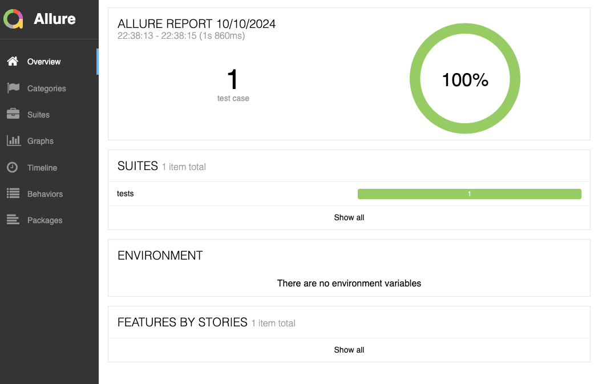

# FANCODE_ASSIGNMENT

**Project Overview**

This project is a test automation framework that checks if users from the city "FanCode" have more than 50% of their todos tasks completed. The project uses the requests library to make API calls to the JSONPlaceholder API and the pytest framework to write and run tests.

**Project Structure**

The project has the following structure:

config.py: This file contains configuration settings for the project, such as the base URL of the JSONPlaceholder API 
and the latitude and longitude ranges for the city "FanCode".

pages: This directory contains page object classes that encapsulate the API endpoints and their corresponding methods.

todos_page.py: This file contains the TodosPage class that encapsulates the /todos API endpoint.

users_page.py: This file contains the UsersPage class that encapsulates the /users API endpoint.

tests: This directory contains test files that use the page object classes to write and run tests.

test_fan_code_users.py: This file contains the test_fan_code_users_completed_tasks_percentage test that checks if users from the city "FanCode" have more than 50% of their todos tasks completed.

**Design Patterns**

The project uses the following design patterns:

**Page Object Model (POM):** The project uses the POM pattern to encapsulate the API endpoints and their corresponding methods in page object classes. This makes the test code more readable and maintainable.

Allure Run Commands

To run the tests and generate the Allure report, use the following commands:

**pytest -v --alluredir=allure-results**: This command runs the tests and saves the results in the allure-results directory.
**allure serve allure-results**: This command starts a web server and opens the Allure report in your default web browser.

**Prerequisites**

To run the project, you need to have the following prerequisites installed:

Python 3.8 or later
requests library
pytest framework
allure command-line tool
Installation

To **install** the project dependencies, run the following command:

**pip install -r requirements.txt**

**Running the Project**

To run the project, navigate to the project directory and run the following command:

**pytest -v --alluredir=allure-results**
This will run the tests and generate the Allure report. You can then view the report by running the following command:

**allure serve allure-results**
This will start a web server and open the Allure report in your default web browser.

